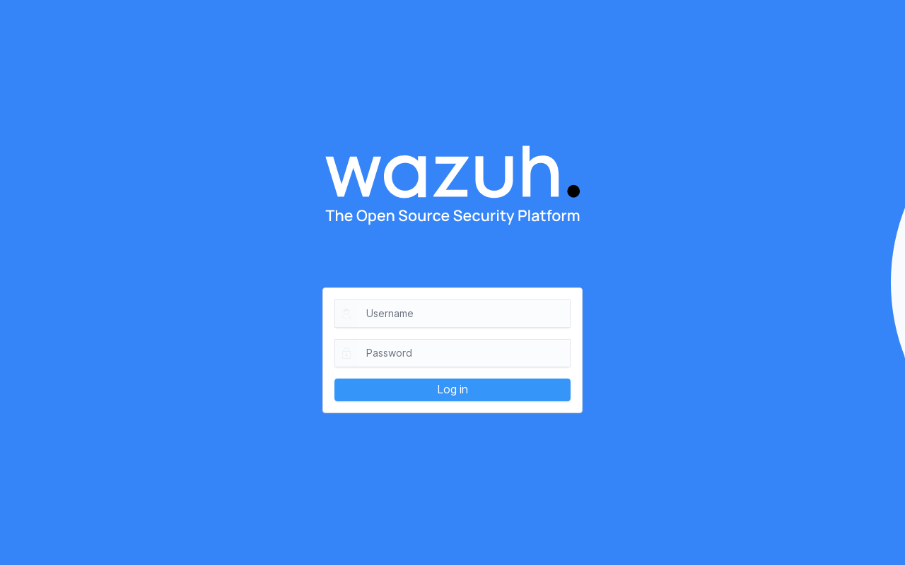

<div style="text-align: center">


</div>

# Wazuh as a Flatcar App

This repo contains a [Butane](https://coreos.github.io/butane/) configuration for deploying [Wazuh](https://wazuh.com/) on [Flatcar Container Linux](https://www.flatcar.org/).

Wazuh is a free, open-source security platform that provides unified XDR and SIEM protection for endpoints and cloud workloads. It offers threat detection, integrity monitoring, incident response, and compliance capabilities.

## Screenshots



## Architecture

The deployment runs three containers managed by systemd:

| Service | Container | Purpose |
|---------|-----------|---------|
| `wazuh-indexer` | `wazuh/wazuh-indexer:4.9.2` | OpenSearch-based indexer for storing security alerts and events |
| `wazuh-manager` | `wazuh/wazuh-manager:4.9.2` | Core manager that receives and analyzes agent data |
| `wazuh-dashboard` | `wazuh/wazuh-dashboard:4.9.2` | Web UI for visualizing security data |

A oneshot `wazuh-setup` service generates TLS certificates on first boot using the official `wazuh-certs-generator` image.

### Ports

| Port | Protocol | Service |
|------|----------|---------|
| 443 | TCP | Wazuh Dashboard (Web UI) |
| 1514 | TCP | Agent communication |
| 1515 | TCP | Agent enrollment |
| 514 | UDP | Syslog collection |
| 55000 | TCP | Wazuh API |
| 9200 | TCP | Wazuh Indexer API |

## Prerequisites

- A machine or VM to provision with Flatcar Container Linux (minimum 4 GB RAM recommended)
- [Butane](https://coreos.github.io/butane/getting-started/) installed locally to transpile `config.yaml` to Ignition JSON

## Quick Start

### 1. Configure

Edit `config.yaml` and update the environment variables in the `wazuh.env` section:

- `INDEXER_PASSWORD` — Change the indexer admin password
- `WAZUH_API_PASSWORD` — Change the API password

### 2. Generate Ignition config

```bash
butane --files-dir . --strict config.yaml -o config.ign
```

### 3. Deploy

Provision a new Flatcar instance on your [platform of choice](https://www.flatcar.org/docs/latest/installing/) and pass `config.ign` as user data.

The services will start automatically on boot:
1. `wazuh-setup` generates TLS certificates (first boot only)
2. `wazuh-indexer` starts the OpenSearch indexer
3. `wazuh-manager` starts the Wazuh manager
4. `wazuh-dashboard` starts the web dashboard

### 4. Access the Dashboard

Open `https://<your-server>` in a browser. The default credentials are:

- **Username**: `admin`
- **Password**: The value of `INDEXER_PASSWORD` from your configuration

### 5. Enroll Agents

Install the [Wazuh agent](https://documentation.wazuh.com/current/installation-guide/wazuh-agent/index.html) on the hosts you want to monitor and point them to your Wazuh manager:

```bash
WAZUH_MANAGER="<your-server>" apt install wazuh-agent
```

## Test locally with QEMU

Fetch the latest Flatcar QEMU images from https://stable.release.flatcar-linux.net/amd64-usr/current/:

- `flatcar_production_qemu_uefi_efi_code.fd`
- `flatcar_production_qemu_uefi_efi_vars.fd`
- `flatcar_production_qemu_uefi_image.img`
- `flatcar_production_qemu_uefi.sh`

Generate the Ignition config and start a local VM:

```bash
butane --files-dir . --strict config.yaml -o config.ign
chmod 755 flatcar_production_qemu_uefi.sh
./flatcar_production_qemu_uefi.sh -i config.ign \
  -p 8443-:443,hostfwd=tcp::1514-:1514,hostfwd=tcp::55000-:55000,hostfwd=tcp::2222-:22 \
  -m 4096 \
  -nographic -snapshot
```

The dashboard will be available at `https://localhost:8443` after a few minutes.

## Customisation

### Memory limits

Adjust `MANAGER_RAM`, `INDEXER_RAM`, and `DASHBOARD_RAM` in the environment file. The indexer is the most memory-intensive component. Minimum recommended total is 4 GB.

### Wazuh version

Change the image tag in the systemd units (default: `4.9.2`). Use matching versions for all three components.

### External indexer

To use an external OpenSearch or Wazuh indexer, remove the `wazuh-indexer` service and update the `INDEXER_URL` and `OPENSEARCH_HOSTS` environment variables.

## Data persistence

| Path | Contents |
|------|----------|
| `/opt/wazuh/config/certs/` | TLS certificates |
| `/opt/wazuh/indexer-data/` | Indexer data (alerts, events) |
| `/opt/wazuh/manager-data/` | Manager data (agent info, rules) |
| `/opt/wazuh/manager-etc/` | Manager configuration |
| `/opt/wazuh/manager-logs/` | Manager logs |

## References

- [Wazuh documentation](https://documentation.wazuh.com/current/)
- [Wazuh Docker deployment](https://documentation.wazuh.com/current/deployment-options/docker/index.html)
- [Wazuh Docker images](https://hub.docker.com/u/wazuh)
- [Flatcar Container Linux](https://www.flatcar.org/)
- [Butane config specification](https://coreos.github.io/butane/config-flatcar-v1_0/)
